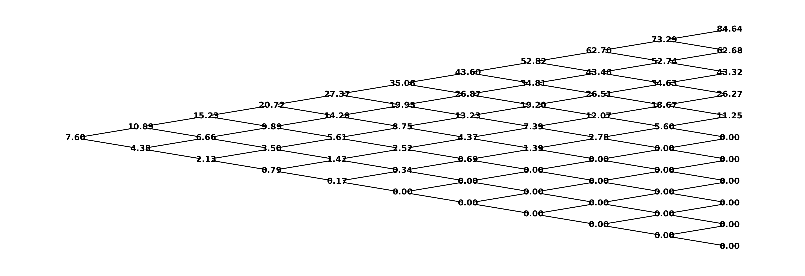
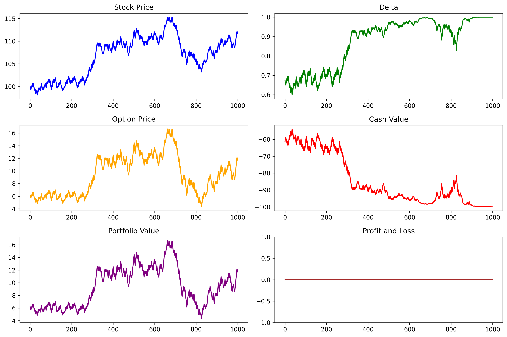
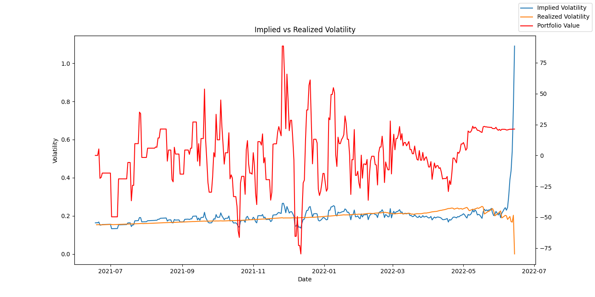
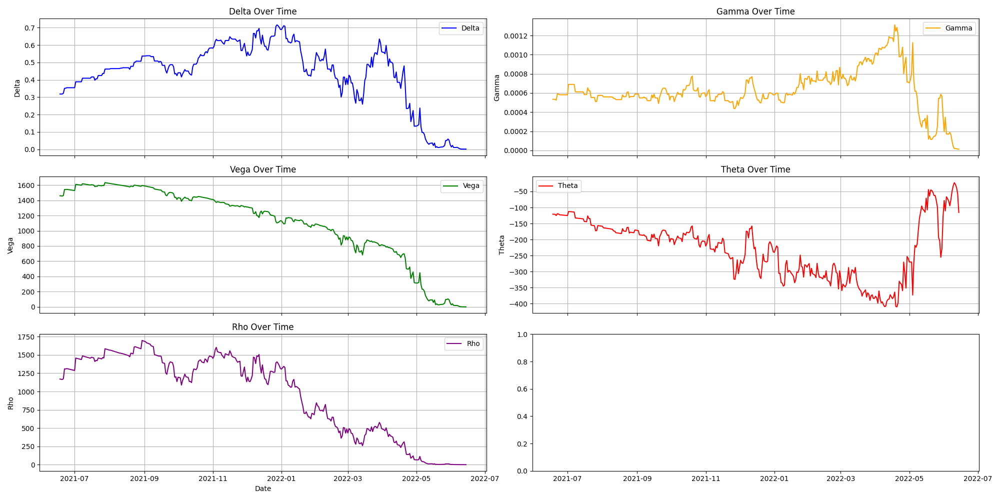
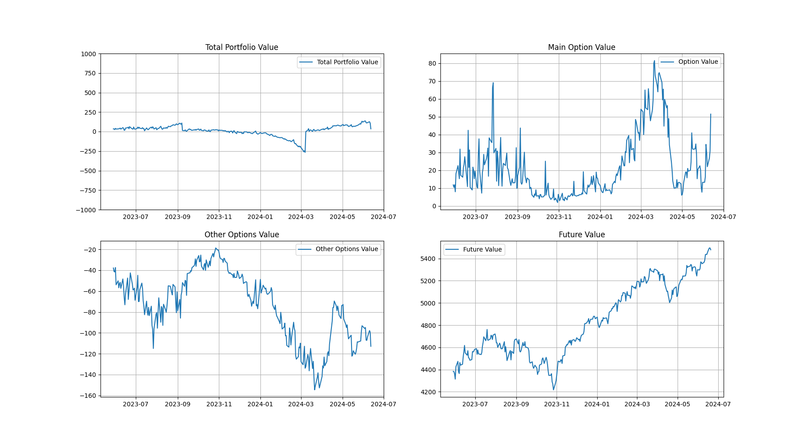
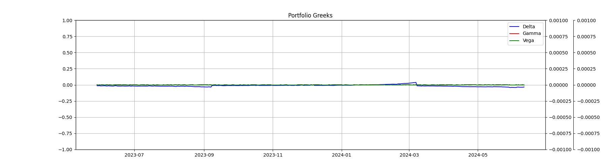

# Delta Hedging Project

Delta hedging is a dynamic risk management technique designed to neutralize the first-order sensitivity of option positions to changes in the underlying asset price. This repository offers a structured, three-phase investigation into the theoretical and empirical aspects of delta hedging:

Discrete-Time Binomial Model: A demonstration using a two-step Cox–Ross–Rubinstein tree, illustrating exact delta hedges at each node under no-arbitrage conditions.

Continuous-Time Greeks Estimation: Application of the Black–Scholes–Merton framework to real ES-Mini option quotes, including numerical inversion to obtain implied volatilities and analytic computation of the primary Greeks—delta (Δ), gamma (Γ), vega (ν), theta (Θ), and rho (ρ).

Multi-Greek Neutral Portfolio Construction: Formulation and backtesting of a daily-rebalanced portfolio that simultaneously neutralizes Δ, Γ, and ν exposures, thereby mitigating directional, curvature, and volatility risk.

## Background 

### Option Greeks

Option prices exhibit sensitivities, known as Greeks, which quantify the effect of small changes in market inputs:

**Delta (Δ)**: ∂V/∂S, the first-order sensitivity of the option value V to the underlying price S.

**Gamma (Γ)**: ∂²V/∂S², the rate of change of delta, measuring convexity in the underlying.

**Vega (ν)**: ∂V/∂σ, sensitivity to implied volatility σ of the underlying’s returns.

**Theta (Θ)**: ∂V/∂t, time decay of the option as time to maturity diminishes.

**Rho (ρ)**: ∂V/∂r, sensitivity to shifts in the risk-free interest rate r.

Accurate Greek computation underpins effective hedging and risk management strategies.

### Implied Volatility Surface

The implied volatility surface is the three-dimensional mapping of market-implied volatilities across strikes K and maturities T:

**Extraction**: For each option quote, solve the Black–Scholes equation for σ_imp using numerical methods (e.g., Newton–Raphson).

**Smoothing**: Apply interpolation or term-structure fitting (e.g., SVI, kernel regression) to build a continuous surface σ_imp(K, T).

**Applications**:

- Model calibration: Fit stochastic or local volatility models.

- Risk assessment: Identify skew and term-structure anomalies.

- Trading signals: Detect relative mispricings across strikes and expiries.

- Data Interpolation: Fill in missing values for options that weren't traded on a given date.

A well-constructed volatility surface enhances pricing accuracy and hedging performance.

---

## Project structure

```
notebooks/
  ├─ Binomial Model.ipynb       # Two-step stock tree and Δ-hedging demo
  ├─ Real World.ipynb           # Implied vol and Greek calculations
  └─ MultiGreekHedging.ipynb    # Δ-Γ-Vega neutral hedging backtest
results/
  ├─ FullDataset.csv            # Raw historical options data
  └─ results.csv                # Backtest results summary
utils/
  ├─ greeks.py                  # Δ, Γ, Vega, Theta, Rho formulas
  ├─ implied_volatility.py      # Implied vol solver (Newton–Raphson)
  ├─ process.py                 # Data cleaning & interpolation
  └─ rollout.py                 # Daily hedging simulation
assets/
  ├─ binomial_tree.png          # Binomial price tree visualization
  ├─ binomial_pnl.png           # Hedged vs unhedged P&L
  ├─ real_world_volatility.png  # Implied volatility surface
  ├─ real_world_greeks.png      # Greeks over time
  ├─ real_world_portfolio.png   # Portfolio value plot
  └─ MultiGreekHedging.png      # Net Greek exposures
README.md                       # This file
```

---

## 1. Binomial Model

**Goal:** See Δ-hedging in a simple two-step stock price tree.

**Steps:**

1. Construct an up/down price tree
2. Price a European option via no-arbitrage
3. Compute Δ at each node and form the hedge

**Visuals:**

<div style="display:flex; gap:1rem;">
  
  
</div>

---

## 2. Greeks via Black‑Scholes (Real World)

**Goal:** Extract Δ, Γ, Vega, Theta and Rho from actual market prices.

**Steps:**

1. Load SPY option prices and underlying data
2. Solve for implied volatility (Newton–Raphson)
3. Compute all greeks using Black‑Scholes formulas

**Visuals:**

<div style="display:flex; gap:1rem;">
  
  
</div>

---

## 3. Multi‑Greek Hedging

**Goal:** Build a daily‑rebalanced portfolio neutral in Δ, Γ and Vega.

**Steps:**

1. Select target option + hedge candidates
2. Compute greeks for all instruments
3. Solve a linear system for hedge ratios
4. Rebalance daily and track exposures

**Visuals:**

<div style="display:flex; gap:1rem;">
  
</div>
<div style="display:flex; gap:1rem;">
  
</div>

---

## Summary of Models

| Model         | Greeks           | Data | Complexity | Use case               |
| ------------- | ---------------- | ---- | ---------- | ---------------------- |
| Binomial      | Δ                | No   | Low        | Teaching & intuition   |
| Black‑Scholes | Δ, Γ, Vega, Θ, ρ | Yes  | Medium     | Greek calculation      |
| Multi‑Greek   | Δ, Γ, Vega       | Yes  | High       | Risk‑minimizing hedges |

---

## Next steps

* Incorporate transaction costs
* Experiment with stochastic volatility (e.g. Heston)
* Connect to real‑time market data for live rebalancing
